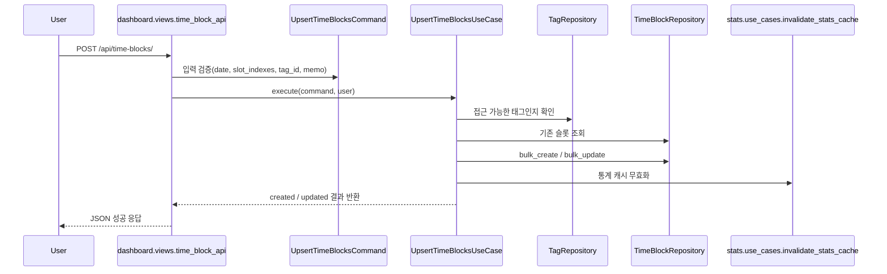
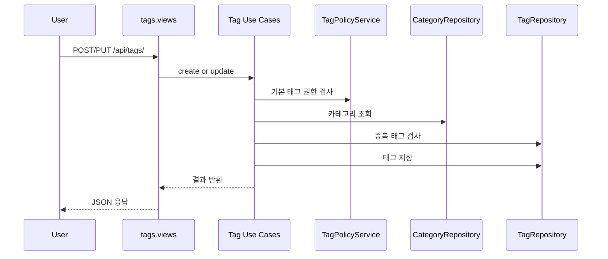
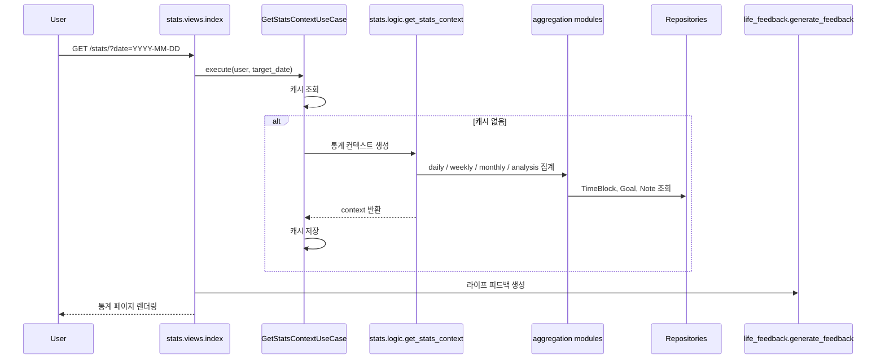

# Life Diary 비즈니스 로직 및 아키텍처 플로우 가이드

> 작성일: 2026-04-21  
> 대상 독자: 면접관, 협업 개발자, 앱 이용을 검토하는 고객  
> 기준 코드: `dashboard`, `tags`, `users`, `stats`, `core`, `lifeDiary` 프로젝트 설정

## 문서 목적

이 문서는 Life Diary가 어떤 문제를 해결하는 서비스인지, 사용자의 기록이 어떤 비즈니스 규칙을 거쳐 통계와 피드백으로 이어지는지, 그리고 그 흐름을 코드가 어떤 구조로 구현하고 있는지를 한 번에 설명하기 위해 작성했다.

앞부분은 고객이 읽기 쉬운 서비스 설명에 가깝고, 뒷부분은 면접관이나 개발자가 구조를 빠르게 파악할 수 있도록 정리했다.

---

## 1. 서비스 한눈에 보기

Life Diary는 하루를 10분 단위로 나눠 기록하는 생활 로그 서비스다. 사용자는 "무엇을 했는지"를 길게 서술하는 대신, 시간 블록을 선택하고 태그를 붙여서 하루를 빠르게 남긴다.  
핵심 경험은 아래 네 단계로 압축된다.

1. 시간을 기록한다.
2. 태그로 활동을 분류한다.
3. 목표와 메모를 함께 관리한다.
4. 통계와 피드백으로 생활 패턴을 돌아본다.

이 서비스가 풀고 있는 문제는 단순하다. 대부분의 생산성 앱은 입력 비용이 높고, 일기 앱은 회고는 쉽지만 구조화가 어렵다. Life Diary는 그 중간을 노린다. 입력은 짧게, 회고는 구조적으로 하자는 방향이다.

---

## 2. 고객 관점의 서비스 플로우

### 2.1 시작

- 사용자는 회원가입 후 바로 로그인할 수 있다.
- 로그인한 사용자는 홈에서 바로 대시보드로 이동해 오늘 기록을 시작한다.

### 2.2 기록

- 하루는 24시간, 총 144개의 10분 슬롯으로 나뉜다.
- 사용자는 특정 날짜를 선택하고, 한 칸 또는 여러 칸을 드래그로 고른다.
- 선택한 시간 구간에 태그와 메모를 저장하면 하루의 흐름이 누적된다.

### 2.3 분류

- 태그는 단순한 라벨이 아니라 생활 분류 체계의 핵심이다.
- 각 태그는 카테고리에 속한다.
- 카테고리는 시스템이 제공하는 5개 대분류를 기준으로 한다.
  - 수동적 소비시간
  - 주도적 사용시간
  - 투자시간
  - 기초 생활시간
  - 수면시간

### 2.4 목표와 메모

- 사용자는 특정 태그에 대해 일간, 주간, 월간 목표 시간을 설정할 수 있다.
- 별도의 메모를 남겨서 목표나 상태를 함께 관리할 수 있다.

### 2.5 회고

- 통계 화면에서는 일간, 주간, 월간 기준으로 활동 시간을 집계한다.
- 단순 합계만 보여주는 것이 아니라, 어떤 태그가 시간을 많이 차지하는지, 특정 활동의 리듬이 얼마나 안정적인지, 기록되지 않은 시간이 얼마나 되는지까지 함께 본다.
- 여기에 규칙 기반 라이프 피드백이 붙어 사용자가 스스로 생활 패턴을 해석할 수 있게 돕는다.

---

## 3. 핵심 비즈니스 로직

### 3.1 시간 기록 규칙

Life Diary의 가장 중요한 비즈니스 규칙은 "하루를 10분 단위의 구조화된 데이터로 저장한다"는 점이다.

- 1일 = 144 슬롯
- 슬롯 범위 = `0 ~ 143`
- 각 슬롯은 사용자, 날짜, 슬롯 인덱스 조합으로 유일해야 한다

즉, 같은 사용자가 같은 날짜의 같은 시간대에 기록을 두 번 가질 수 없다.  
이 규칙은 `TimeBlock` 모델의 unique constraint로 보장된다.

### 3.2 태그 접근 규칙

태그는 두 종류다.

- 기본 태그: 모든 사용자가 공통으로 접근 가능
- 사용자 태그: 해당 사용자만 접근 가능

따라서 시간 기록이나 목표 저장 시 태그를 아무거나 참조할 수 없다.  
현재 구조에서는 "기본 태그이거나 본인 소유 태그인지"를 저장 시점에 검증한다.

### 3.3 카테고리 규칙

- 태그는 반드시 하나의 카테고리를 가진다.
- 카테고리는 활동을 큰 관점에서 묶기 위한 기준축이다.
- 사용자는 태그 단위로 기록하지만, 통계에서는 이 태그들이 더 큰 생활 흐름으로 읽히게 된다.

즉, 카테고리는 사용자의 직접 입력 단위는 아니지만 서비스의 해석 단위다.

### 3.4 목표 규칙

목표는 태그 기준으로 저장된다.  
예를 들어 "운동" 태그에 대해 주간 5시간 같은 형태다.

기간별 상한도 모델 규칙으로 잡혀 있다.

- 일간 목표: 최대 24시간
- 주간 목표: 최대 100시간
- 월간 목표: 최대 300시간

목표 달성률은 별도 도메인 서비스가 통계 결과를 읽어서 계산한다.

### 3.5 미기록 시간 처리

이 프로젝트의 특징 중 하나는 "기록되지 않은 시간"도 의미 있는 데이터로 취급한다는 점이다.

- 기록되지 않은 슬롯은 `미분류` 시간으로 간주된다.
- 일간, 주간, 월간, 분석 통계에 모두 반영된다.

이 덕분에 사용자는 "내가 무엇을 했는가"뿐 아니라 "무엇을 기록하지 않았는가"도 볼 수 있다.  
생활 관리 서비스로서는 꽤 중요한 관점이다.

### 3.6 라이프 피드백 규칙

통계는 숫자를 보여주고, 피드백은 그 숫자를 해석해 준다. 현재 피드백은 규칙 기반이다.

- 목표 달성 여부 피드백
- 특정 활동이 월간 시간의 60% 이상을 차지할 때 균형 경고
- 활동 시간 변동성이 큰 경우 리듬 경고
- 수면 시간이 월간 시간의 60% 이상일 때 경고
- 미분류 시간이 월간 시간의 20% 이상일 때 기록 습관 경고

이 구조는 AI 추천보다 단순하지만, 왜 이런 메시지가 나왔는지 설명 가능하다는 장점이 있다.

---

## 4. 도메인 모델

핵심 데이터 관계는 아래처럼 정리할 수 있다.

```text
User
 ├─ Tag (사용자 태그)
 ├─ TimeBlock
 ├─ UserGoal
 └─ UserNote

Category
 └─ Tag

Tag
 ├─ TimeBlock
 └─ UserGoal
```

각 모델의 역할은 다음과 같다.

| 모델 | 역할 |
|------|------|
| `User` | 서비스의 주체 |
| `Category` | 태그를 묶는 상위 생활 분류 |
| `Tag` | 실제 기록과 목표의 기준 단위 |
| `TimeBlock` | 10분 단위 생활 기록 |
| `UserGoal` | 태그 기준 목표 시간 |
| `UserNote` | 사용자 메모 |

---

## 5. 아키텍처 개요

현재 프로젝트는 Django 모놀리식 구조를 유지하면서, 앱 단위로 책임을 나누는 방식이다.

### 5.1 앱 구성

| 앱 | 책임 |
|----|------|
| `dashboard` | 시간 기록 조회/저장/삭제 |
| `tags` | 태그, 카테고리 관리 |
| `users` | 인증, 목표, 메모, 마이페이지 |
| `stats` | 집계, 피드백, 캐시 |
| `core` | 공통 상수, 날짜 처리, JSON 응답 유틸 |

### 5.2 레이어 구조

현재 코드는 아래 흐름을 중심으로 정리돼 있다.

```text
HTTP Request
  -> views.py
  -> use_cases.py
  -> repositories.py / domain_services.py
  -> models.py
  -> DB
```

역할을 조금 더 풀면 다음과 같다.

| 레이어 | 역할 |
|--------|------|
| `views.py` | 요청 파싱, 인증 체크, 응답 반환 |
| `use_cases.py` | 하나의 기능 흐름을 조립하는 애플리케이션 로직 |
| `repositories.py` | ORM 쿼리 전담 |
| `domain_services.py` | 정책 판단, 계산 로직 |
| `models.py` | 데이터 제약과 영속화 규칙 |

완전한 클린 아키텍처는 아니지만, 단순 Django CRUD보다 한 단계 더 구조화된 형태라고 보는 것이 정확하다.

---

## 6. 대표 요청 플로우

### 6.1 시간 기록 저장 플로우

가장 중요한 실사용 플로우다.



이 플로우의 의미는 단순 저장이 아니다.

- 입력 검증
- 태그 권한 검증
- 기존 기록과 신규 기록의 분기 처리
- 통계 캐시 무효화

까지 한 번에 일어난다.  
즉, 기록 저장은 서비스의 나머지 기능과 연결된 핵심 트랜잭션이다.

### 6.2 태그 생성 및 수정 플로우



여기서 중요한 비즈니스 포인트는 "태그는 사용자 자유 입력이지만, 서비스 해석 구조를 망가뜨리면 안 된다"는 점이다.  
그래서 카테고리, 중복, 기본 태그 권한 같은 정책이 함께 적용된다.

### 6.3 통계 조회 플로우



이 구조 덕분에 통계는 단순 조회를 넘어, "집계 결과 + 목표 진척도 + 피드백"을 한 화면에서 연결해 준다.

### 6.4 마이페이지 플로우

마이페이지는 사용자 관리 화면이면서 동시에 간단한 회고 화면이다.

- 사용자의 목표를 조회한다.
- 필요한 기간의 통계를 다시 계산한다.
- 목표별 실제 시간과 달성률을 붙인다.
- 최신 메모를 함께 보여준다.

즉, 마이페이지는 단순 프로필 화면이 아니라 "개인 운영 대시보드"에 가깝다.

---

## 7. 현재 아키텍처의 강점

### 7.1 기능 축이 명확하다

`dashboard`, `tags`, `users`, `stats`로 기능이 잘 끊겨 있다.  
면접에서는 "기록, 분류, 목표, 회고"라는 비즈니스 축이 코드 구조에도 반영돼 있다는 점을 설명하기 좋다.

### 7.2 비즈니스 규칙이 모델과 유스케이스에 분산 정리돼 있다

중요한 규칙이 전부 템플릿이나 자바스크립트에 있지 않다.

- 시간 블록 유일성
- 목표 상한
- 태그 접근 가능 여부
- 기본 태그 정책

같은 규칙이 서버 기준으로 정리돼 있어서 데이터 무결성을 지키기 쉽다.

### 7.3 통계 캐시 전략이 현실적이다

통계는 비용이 큰 기능인데, 현재 구조는 날짜 기준 캐시를 둔다.

- 과거 날짜: 24시간 캐시
- 오늘 날짜: 5분 캐시

생활 기록 서비스 특성에 맞는 타협이다. 오늘은 변하고, 과거는 거의 안 변한다는 점을 코드가 반영하고 있다.

### 7.4 규칙 기반 피드백이 설명 가능하다

피드백 로직은 복잡한 추천 모델이 아니라 기준이 드러나는 규칙 기반이다.  
고객에게는 이해하기 쉽고, 면접관에게는 "복잡도보다 해석 가능성을 먼저 택했다"는 설계 선택으로 설명할 수 있다.

---

## 8. 현재 아키텍처의 한계

### 8.1 앱 간 의존이 아직 있다

예를 들어 통계는 `dashboard`의 기록 데이터와 `users`의 목표 데이터를 함께 읽는다.  
즉, 모듈이 완전히 독립적이지는 않다.

### 8.2 `stats`는 읽기 전용 앱이 아니라 집계 오케스트레이터에 가깝다

집계 모듈, 캐시, 목표 연동, 피드백까지 담당하고 있어 상대적으로 책임이 무겁다.

### 8.3 뷰가 여전히 얇아지는 과정에 있다

초기 구조보다 나아졌지만, 일부 입력 변환과 폼 처리 책임은 아직 뷰에 남아 있다.  
면접에서는 이 점을 솔직하게 설명하는 편이 좋다. "작은 Django 프로젝트에서 시작했고, 이후 유스케이스 계층을 점진적으로 도입했다"는 식이 자연스럽다.

---

## 9. 면접에서 설명하기 좋은 포인트

### 9.1 왜 10분 단위인가

1시간 단위보다 생활 흐름을 더 잘 잡고, 1분 단위보다 입력 부담이 낮기 때문이다.  
정밀도와 입력 비용의 균형점으로 10분을 선택한 셈이다.

### 9.2 왜 태그와 카테고리를 분리했는가

태그는 사용자의 표현 단위이고, 카테고리는 서비스의 해석 단위다.  
사용자는 자유롭게 기록하되, 시스템은 그 기록을 더 큰 생활 패턴으로 읽을 수 있어야 한다.

### 9.3 왜 AI 피드백이 아니라 규칙 기반 피드백부터 시작했는가

초기 단계에서 중요한 것은 "정확한 추천"보다 "신뢰 가능한 설명"이다.  
사용자가 왜 이런 피드백을 받았는지 이해할 수 있어야 서비스가 납득된다.

### 9.4 왜 Django 모놀리스를 유지했는가

현재 서비스 범위에서는 배포 복잡도와 개발 속도를 고려할 때 모놀리스가 더 유리하다.  
대신 앱 경계와 레이어를 나눠서 나중에 복잡도가 올라가도 버틸 수 있게 만들고 있다.

---

## 10. 요약

Life Diary는 "생활을 많이 쓰지 않고도 돌아볼 수 있게 만드는 서비스"다.  
비즈니스 로직의 중심은 다음 네 가지다.

- 하루를 10분 단위 구조화 데이터로 저장한다.
- 태그와 카테고리로 생활 활동을 분류한다.
- 목표와 메모를 붙여 개인 운영 기준을 만든다.
- 통계와 규칙 기반 피드백으로 사용자가 자기 패턴을 해석하게 돕는다.

아키텍처 관점에서는 Django 모놀리스 위에 앱 분리와 레이어 분리를 적용한 형태다.  
아직 완전히 무거운 엔터프라이즈 구조는 아니지만, 단순 CRUD를 넘어 실제 비즈니스 규칙과 데이터 흐름을 관리할 수 있는 수준까지는 올라와 있다.

이 프로젝트를 한 문장으로 요약하면 이렇다.

> **Life Diary는 생활 기록을 부담 없이 남기고, 그 기록을 다시 생활 인사이트로 돌려주는 구조화된 회고 서비스다.**
