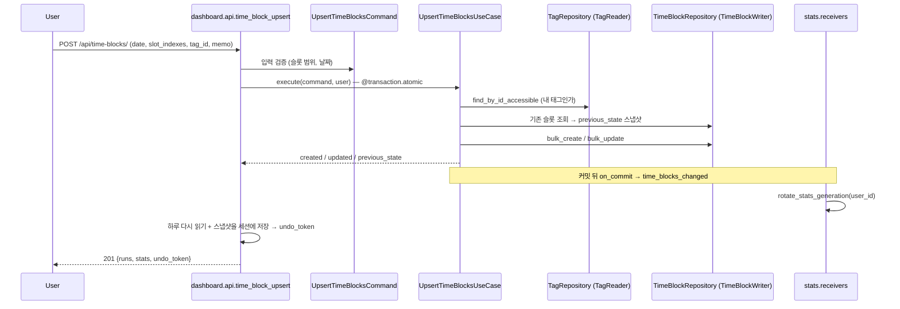
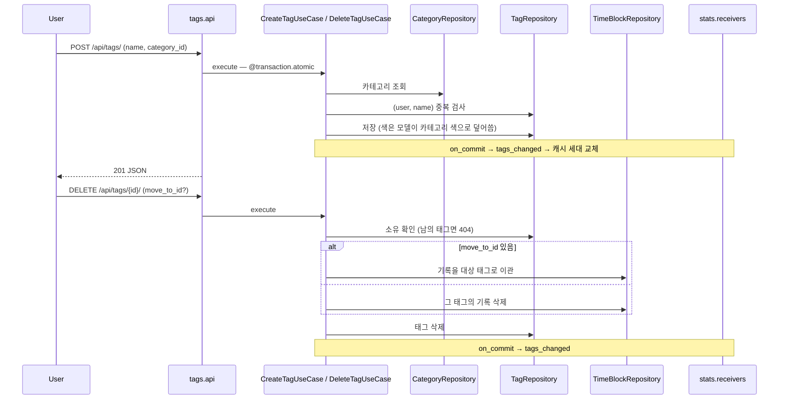
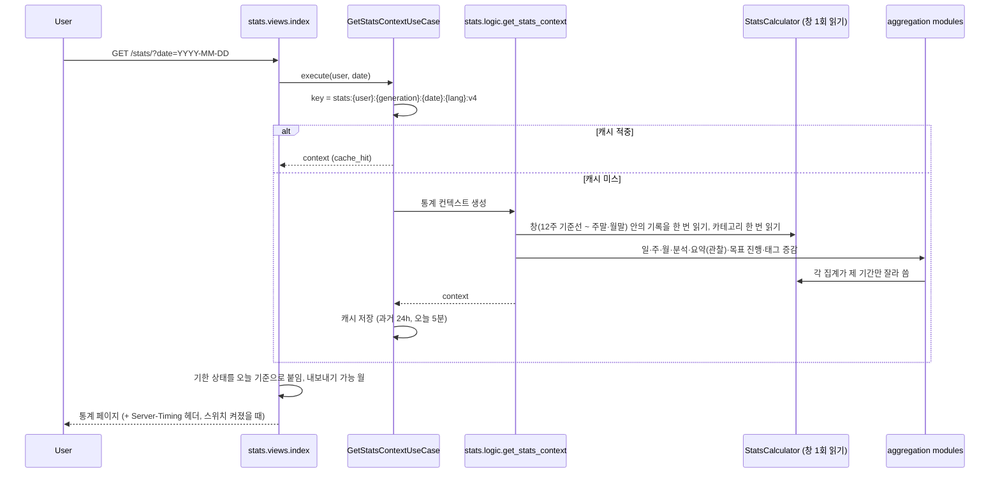

# Life Diary 비즈니스 로직 및 아키텍처 플로우 가이드

> 작성일: 2026-04-21 · 갱신일: 2026-10-08  
> 대상 독자: 면접관, 협업 개발자, 앱 이용을 검토하는 고객  
> 기준 코드: `dashboard`, `tags`, `users`, `stats`, `core`, `lifeDiary` 프로젝트 설정, `desktop/` (브랜치 `feat/goal-due-date`, 2026-10-08)

## 문서 목적

이 문서는 Life Diary가 어떤 문제를 해결하는 서비스인지, 사용자의 기록이 어떤 비즈니스 규칙을 거쳐 통계와 관찰로 이어지는지, 그리고 그 흐름을 코드가 어떤 구조로 구현하고 있는지를 한 번에 설명하기 위해 작성했다.

앞부분은 고객이 읽기 쉬운 서비스 설명에 가깝고, 뒷부분은 면접관이나 개발자가 구조를 빠르게 파악할 수 있도록 정리했다.

2026-04-21 초판 이후 바뀐 것은 다음과 같다. 공유 기본 태그 개념 폐기, JSON API의 django-ninja 이식, 이메일 6자리 코드 인증, 계정 삭제 유예와 자동 purge, 규칙 기반 피드백을 사실 관찰로 교체, 통계 캐시의 사용자 세대 토큰과 요청당 1회 읽기, 목표 관리 화면 통합과 선택 기한. 이번 갱신은 이 변화를 반영한다.

---

## 1. 서비스 한눈에 보기

Life Diary는 하루를 10분 단위로 나눠 기록하는 생활 로그 서비스다. 사용자는 "무엇을 했는지"를 길게 서술하는 대신, 시간 블록을 선택하고 태그를 붙여서 하루를 빠르게 남긴다.  
핵심 경험은 아래 네 단계로 압축된다.

1. 시간을 기록한다.
2. 태그로 활동을 분류한다.
3. 목표(선택 기한 포함)와 메모를 함께 관리한다.
4. 통계와 사실 관찰로 생활 패턴을 돌아본다.

이 서비스가 풀고 있는 문제는 단순하다. 대부분의 생산성 앱은 입력 비용이 높고, 일기 앱은 회고는 쉽지만 구조화가 어렵다. Life Diary는 그 중간을 노린다. 입력은 짧게, 회고는 구조적으로 하자는 방향이다.

---

## 2. 고객 관점의 서비스 플로우

### 2.1 시작

- 가입하면 이메일로 받은 6자리 코드를 한 번 입력해 주소를 확인한다. 코드 인증 전에는 로그인할 수 없다(가입 전에 있던 계정은 인증 완료로 간주).
- Google 로그인도 된다. 제공자가 인증한 주소면 그대로 인증 표시된다.
- 가입과 동시에 카테고리별 기본 태그가 **그 사용자 소유로** 만들어진다. 태그가 만들어지지 못하면 가입 자체가 롤백된다.
- 가입 직후 3단계 온보딩(태그 고르기, 오늘 기록 채우기, 목표 하나 정하기)이 한 번 나온다. 세 단계 모두 건너뛸 수 있다.

### 2.2 기록

- 하루는 24시간, 총 144개의 10분 슬롯으로 나뉜다.
- 사용자는 특정 날짜를 선택하고, 한 칸 또는 여러 칸을 드래그로 고른다. 모바일에서는 바텀시트로 태그를 고른다.
- 선택한 시간 구간에 태그와 메모(500자)를 저장하면 하루의 흐름이 누적된다. 태그는 필수다.
- 저장·삭제 직후 60초 동안 "되돌리기"가 가능하다.
- 기한이 가까운 목표(지난 3일부터 앞으로 7일)가 있으면 대시보드 위에 상기 배너가 뜬다.

### 2.3 분류

- 태그는 단순한 라벨이 아니라 생활 분류 체계의 핵심이다.
- 태그는 전부 사용자 개인 소유다. 모든 사용자가 공유하는 기본 태그는 없다(2026-08 폐기). 이름은 10자까지다.
- 각 태그는 카테고리에 속하고, 색은 카테고리가 정한다.
- 카테고리는 시스템이 제공하는 5개 대분류를 기준으로 한다.
  - 수동적 소비시간 (`passive`)
  - 주도적 사용시간 (`proactive`)
  - 투자시간 (`investment`)
  - 기초 생활시간 (`basic_life`)
  - 수면시간 (`sleep`)
- 태그를 지울 때는 그 태그의 기록을 다른 태그로 옮기거나, 옮기지 않고 기록까지 함께 지운다.

### 2.4 목표와 메모

- 목표는 (태그, 기간, 목표 시간)이고, 기한을 선택으로 정할 수 있다. 같은 태그·기간의 목표는 하나만 둔다.
- 기한이 있으면 D-day 배지가 붙는다. D-4 이상은 중립, D-3부터 당일까지는 경고, 지나면 "기한 지남"으로 바뀐다. 기한이 지나도 목표와 진행률은 그대로다.
- 목표 관리는 한 화면이다. 표 안에서 바로 고치고, 추가하고, 지우고, 8초 안에 되돌릴 수 있다. JS가 없어도 같은 폼이 그대로 동작한다.
- 메모는 최신 한 건을 설정 화면에서 함께 본다.

### 2.5 회고

- 분석 화면은 요약·일·주·월 네 탭으로 활동 시간을 집계한다. 태그별 분석 데이터는 같은 요청에서 함께 집계돼 차트에 쓰인다.
- 요약 탭은 지난 7일을 기준으로 카테고리 비중, 기록 밀도, 목표 달성일을 보여주고, 그 아래 **사실 관찰**을 최대 4개 붙인다. 관찰은 판단하지 않고 사실만 말한다. 지난 7일 가장 많은 태그와 비중, 비어 있는 시간대, 매일 기록한 시간대, 목표 달성일이다.
- 목표 진행 바에는 오늘 기준 페이스 선이 있어, 페이스보다 뒤처진 목표만 붉게 보인다.
- 기록되지 않은 시간은 "미분류"로 모든 집계에 들어간다.
- 월간 기록은 엑셀로 내려받을 수 있다.

### 2.6 계정

- 탈퇴를 요청하면 계정이 비활성화되고 15일 유예가 시작된다. 유예 중에 로그인(Google 포함)하면 탈퇴가 취소된다.
- 유예가 끝난 계정은 매일 한 번 도는 배치가 영구 삭제한다. 이메일을 마스킹한 최소 감사 기록만 남는다.
- 비밀번호 재설정도 링크가 아니라 이메일 6자리 코드로 한다.

---

## 3. 핵심 비즈니스 로직

### 3.1 시간 기록 규칙

Life Diary의 가장 중요한 비즈니스 규칙은 "하루를 10분 단위의 구조화된 데이터로 저장한다"는 점이다.

- 1일 = 144 슬롯
- 슬롯 범위 = `0 ~ 143`
- 각 슬롯은 사용자, 날짜, 슬롯 인덱스 조합으로 유일해야 한다 (`TimeBlock`의 `UniqueConstraint`)
- 태그는 필수다. 2026-10 마이그레이션이 남아 있던 태그 없는 기록 190건을 정리하고 `tag`를 NOT NULL로 바꿨다
- 메모는 500자까지다

되돌리기 규칙은 다음과 같다.

- 저장·삭제 유스케이스는 바꾸기 전 상태(슬롯별 태그·메모)를 `previous_state`로 돌려준다.
- API는 이 스냅샷을 **사용자 세션 안에** 토큰과 함께 보관한다(`dashboard/undo.py`). 토큰만으로는 아무것도 열리지 않는다. 전역 저장소에 두면 토큰을 추측한 사람이 남의 되돌리기를 재생할 수 있다.
- 토큰은 60초 뒤 만료되고, 세션당 최근 3개만 남긴다. 한 번 쓴 토큰은 사라진다.
- 복원할 때 스냅샷의 태그 id를 믿지 않고 소유권을 다시 확인한다.

### 3.2 태그 접근 규칙

태그는 전부 개인 소유다. 규칙은 하나다. **자기 것만 다룬다.** 관리자도 예외가 아니다(`TagPolicyService.can_manage`: `tag.user_id == user.id`).

시간 기록과 목표 저장은 `find_by_id_accessible`로 "이 사용자의 태그인지"를 저장 시점에 확인하고, 아니면 404로 답한다. 403이 아니라 404인 이유는 "그 id가 존재한다"는 정보를 새지 않게 하기 위해서다.

### 3.3 카테고리 규칙

- 태그는 반드시 하나의 카테고리를 가진다. 태그가 붙어 있는 카테고리는 지울 수 없다(`PROTECT`).
- 태그 색은 카테고리 색을 따른다. 사용자가 색을 보내도 모델 `save()`가 카테고리 색으로 덮어쓴다. 같은 카테고리가 한 덩어리로 읽히게 하기 위해서다.
- 정책 판단은 편집 가능한 이름이 아니라 `Category.slug`로 한다. 주간 활동 시간에서 수면을 빼는 규칙은 `slug == "sleep"` 기준이다.

즉, 카테고리는 사용자의 직접 입력 단위는 아니지만 서비스의 해석 단위다.

### 3.4 목표 규칙

목표는 태그 기준으로 저장된다. 예를 들어 "운동" 태그에 대해 주간 5시간 같은 형태다.

- 기간별 상한은 모델 규칙이다. 일간 24시간, 주간 100시간, 월간 300시간.
- 같은 사용자·태그·기간 조합은 하나만 둔다. 둘이면 어느 쪽이 진행률에 반영되는지 사용자가 알 수 없다. 이 규칙은 폼(`UserGoalForm.clean`)에 있고 DB 제약은 아직 없다.
- 기한 규칙:
  - "기한 없음" 체크가 날짜보다 우선한다. 체크를 풀고 날짜를 비우면 거부한다.
  - 과거 날짜는 **새로 정하거나 바꿀 때만** 거부한다. 이미 지난 기한까지 막으면 그 목표의 다른 칸을 고칠 수 없고, 지운 목표를 되돌릴 때 기한을 잃는다.
  - 기한 상태(`none` / `upcoming` / `due_today` / `overdue`)는 순수 함수 `goal_deadline.deadline_state(due_date, today)`가 요청한 날 기준으로 계산한다. 캐시에는 `due_date`만 넣고 상태는 넣지 않는다.
- 진행률은 통계 집계(`stats/aggregation/goal_progress.py`)가 계산한다. 기간 합계를 목표 시간으로 나누고, 오늘 기준 경과 비율(페이스)보다 낮으면 `is_behind_pace`다. 달성일 수는 하루 목표 환산치를 넘긴 날을 센다.

### 3.5 미기록 시간 처리

이 프로젝트의 특징 중 하나는 "기록되지 않은 시간"도 의미 있는 데이터로 취급한다는 점이다.

- 기록되지 않은 슬롯은 `미분류` 시간으로 간주된다.
- 일간, 주간, 월간, 분석 통계에 모두 반영된다.
- 집계의 내부 key는 표시명이 아니라 `tag:<id>`와 `unclassified`다(`aggregation/category_keys.py`). 사용자가 "미분류"라는 이름의 태그를 만들어도 합성 항목과 섞이지 않는다.

이 덕분에 사용자는 "내가 무엇을 했는가"뿐 아니라 "무엇을 기록하지 않았는가"도 볼 수 있다.

### 3.6 관찰 규칙

초판의 규칙 기반 피드백("60% 이상이면 균형 경고" 같은 판단)은 2026-08 통계 화면 재작성에서 **사실 관찰**로 바뀌었다. 관찰은 숫자를 해석하지 않고 보여 준다.

- 지난 7일 가장 많은 태그와 그 비중
- 지난 7일 중 비어 있던 시간대와 그런 날의 수
- 매일 기록한 시간대
- 목표 달성일 (예: "독서 목표 4/7일, 하루 1시간 기준")

기록이 하나도 없으면 아무 말도 하지 않는다. 대조할 것이 없으면 "비어 있습니다"만 늘어놓게 되기 때문이다. 최대 4개다. 색은 판정이 아니라 태그를 가리킨다.

### 3.7 이메일 코드 인증 규칙

- 코드는 6자리 숫자이고 **해시로만** 저장한다. 평문은 메일에만 있다.
- 수명 10분, 코드당 시도 3회.
- 재발송은 60초 쿨다운, 1시간에 5회까지.
- 용도는 `signup`과 `password_reset` 둘이다. 재설정은 코드를 확인한 뒤 10분 안에 새 비밀번호를 정해야 한다.
- 운영 스위치(`EMAIL_VERIFICATION_ENABLED`)를 끄면 가입 즉시 인증 완료로 처리한다. 데스크톱 설정은 끈다.

### 3.8 계정 삭제 규칙

- 탈퇴 요청은 계정을 비활성화하고 15일 뒤를 삭제 예정일로 적는다. 취소한 뒤 다시 요청할 수 있다.
- 유예 중 로그인은 요청을 취소한다. Google 로그인도 같다. 유예가 지난 뒤의 로그인은 계정을 되살리지 않는다.
- `purge_deleted_accounts` 명령이 만기 계정을 지우고 `DeletedAccountRecord`(마스킹한 이메일, 원래 user id, 시각)만 남긴다. `--check`는 밀린 건수만 센다.

---

## 4. 도메인 모델

핵심 데이터 관계는 아래처럼 정리할 수 있다.

```text
User
 ├─ Tag (전부 개인 소유)
 ├─ TimeBlock
 ├─ UserGoal (due_date 선택)
 ├─ UserNote
 ├─ EmailVerification / EmailVerificationCode
 └─ AccountDeletionRequest ─(purge)─▶ DeletedAccountRecord

Category
 └─ Tag

Tag
 ├─ TimeBlock (tag 필수)
 └─ UserGoal
```

각 모델의 역할은 다음과 같다.

| 모델 | 역할 |
|------|------|
| `User` | 서비스의 주체 |
| `Category` | 태그를 묶는 상위 생활 분류. 색과 정렬 순서를 가진다 |
| `Tag` | 실제 기록과 목표의 기준 단위. (사용자, 이름) 유일 |
| `TimeBlock` | 10분 단위 생활 기록. (사용자, 날짜, 슬롯) 유일 |
| `UserGoal` | 태그 기준 목표 시간과 선택 기한 |
| `UserNote` | 사용자 메모 |
| `EmailVerification` | 사용자의 이메일 인증 여부 |
| `EmailVerificationCode` | 1회용 인증 코드의 해시, 만료, 시도 횟수, 소진 시각 |
| `AccountDeletionRequest` | 탈퇴 요청과 삭제 예정일, 취소·purge 시각 |
| `DeletedAccountRecord` | purge 뒤 남기는 마스킹 감사 기록 |

---

## 5. 아키텍처 개요

현재 프로젝트는 Django 모놀리식 구조를 유지하면서, 앱 단위로 책임을 나누는 방식이다.

### 5.1 앱 구성

| 앱 | 책임 |
|----|------|
| `dashboard` | 시간 기록 조회/저장/삭제/되돌리기, 슬롯 JSON API, 하루 창(미래 슬롯) 표시, 기한 상기 배너 |
| `tags` | 태그·카테고리 관리와 JSON API, 가입 시 기본 태그 시드, 태그 정책 |
| `users` | 인증(로그인 실패 제한·reCAPTCHA), 이메일 코드 인증, 소셜 가입 어댑터, 계정 삭제 유예·purge, 목표(기한), 메모, 설정, 온보딩 |
| `stats` | 집계(요청당 창 1회 읽기), 관찰, 목표 진행, 캐시 세대, 엑셀 내보내기, `Server-Timing` |
| `core` | 공통 상수·날짜 유틸, CSP 미들웨어, Resend 메일 백엔드(설정에서는 아직 미사용), API 공통 봉투, 템플릿 태그 |

`lifeDiary/`에는 설정 세 벌(`dev`, `prod`, `desktop`), 루트 라우팅, 공개 페이지(홈·개인정보·약관·robots·sitemap), `api.py`(NinjaAPI 조립)가 있다. `desktop/launcher.py`는 waitress와 pywebview로 같은 Django 앱을 띄운다.

### 5.2 레이어 구조

현재 코드는 아래 흐름을 중심으로 정리돼 있다.

```text
HTTP Request
  -> views.py (HTML)  /  api.py (JSON, django-ninja)
  -> commands.py (입력 검증, pydantic)
  -> use_cases.py (@transaction.atomic, 끝나면 on_commit 시그널)
  -> repositories.py / domain_services.py
  -> models.py
  -> DB
```

역할을 조금 더 풀면 다음과 같다.

| 레이어 | 역할 |
|--------|------|
| `views.py` | HTML 요청 파싱, 폼, 세션, 템플릿 렌더 |
| `api.py` | JSON 오퍼레이션. 스키마 검증과 예외를 응답 봉투로 바꾸는 일만 한다 |
| `commands.py` | 유스케이스 입력(pydantic). 슬롯 범위, 날짜 같은 형식 검증 |
| `use_cases.py` | 하나의 기능 흐름을 조립하는 애플리케이션 로직. 트랜잭션 경계 |
| `ports.py` | 유스케이스가 의존하는 읽기·쓰기 인터페이스(`Protocol`) |
| `repositories.py` | ORM 쿼리 전담 |
| `domain_services.py` / 순수 모듈 | 정책 판단, 계산 (`TagPolicyService`, `goal_deadline`, `name_limit`, `day_window`) |
| `signals.py` / `receivers.py` | 앱 사이의 사건 알림과 구독 |
| `models.py` | 데이터 제약과 영속화 규칙 |

완전한 클린 아키텍처는 아니지만, 단순 Django CRUD보다 한 단계 더 구조화된 형태라고 보는 것이 정확하다.

### 5.3 앱 사이의 의존 방향

```text
dashboard ──signal──▶ stats ◀──signal── tags
    │                  ▲                 ▲
    │ read             │ read            │ read
    ▼                  │                 │
  users ◀──signal──────┘       users ────┘ (seed, TagReader)
```

- 쓰기 유스케이스(`dashboard`, `tags`, `users`)는 끝날 때 `transaction.on_commit`으로 `time_blocks_changed`, `tags_changed`, `goals_changed`, `notes_changed`를 보낸다. 커밋 전에 보내면 다른 요청이 아직 반영되지 않은 데이터로 새 캐시를 채울 수 있다.
- `stats`는 네 시그널을 **구독만** 하고(`stats/receivers.py`), 받으면 그 사용자의 캐시 세대를 바꾼다. 소유 앱을 쓰지 않는다.
- `stats`는 `dashboard`·`users`·`tags`의 데이터를 리포지토리로 읽는다. `dashboard`는 `users`(기한 가까운 목표)와 `tags`(자주 쓰는 태그, `TagReader`)를 읽는다. `users`는 `tags`(기본 태그 시드, 태그 접근 확인)를 읽는다.
- 계약 테스트(`apps/dashboard/test_domain_boundaries.py`)가 고정하는 것은 "`dashboard`는 `stats`를 import하지 않는다"다. 나머지 방향은 관례로만 지킨다.

### 5.4 설정과 실행 환경

| 환경 | 내용 |
|------|------|
| `prod` | Render(gunicorn + whitenoise), Supabase PostgreSQL, Cloudflare 엣지, 파일 캐시(`/tmp`), Gmail SMTP, django-axes, CSP 미들웨어, `STATS_SERVER_TIMING_ENABLED` 스위치 |
| `dev` | SQLite, 콘솔 메일, 파일 캐시 |
| `desktop` | waitress + pywebview, 사용자 데이터 디렉터리의 SQLite와 영속 SECRET_KEY, axes·이메일 인증 끔, 로컬 호스트만 |

CI는 GitHub Actions 워크플로 4개다. PR 검사(pytest·`manage.py check`·카탈로그 컴파일·collectstatic), `main` 머지 시 배포 PR 갱신, `production` 배포(롤백은 직전 SHA 지정), 매일 03:47 KST 탈퇴 계정 purge.

---

## 6. 대표 요청 플로우

### 6.1 시간 기록 저장 플로우

가장 중요한 실사용 플로우다.


```mermaid
sequenceDiagram
    participant U as User
    participant A as dashboard.api.time_block_upsert
    participant C as UpsertTimeBlocksCommand
    participant UC as UpsertTimeBlocksUseCase
    participant TR as TagRepository (TagReader)
    participant TBR as TimeBlockRepository (TimeBlockWriter)
    participant S as stats.receivers

    U->>A: POST /api/time-blocks/ (date, slot_indexes, tag_id, memo)
    A->>C: 입력 검증 (슬롯 범위, 날짜)
    A->>UC: execute(command, user)  — @transaction.atomic
    UC->>TR: find_by_id_accessible (내 태그인가)
    UC->>TBR: 기존 슬롯 조회 → previous_state 스냅샷
    UC->>TBR: bulk_create / bulk_update
    UC-->>A: created / updated / previous_state
    Note over UC,S: 커밋 뒤 on_commit → time_blocks_changed
    S->>S: rotate_stats_generation(user_id)
    A->>A: 하루 다시 읽기 + 스냅샷을 세션에 저장 → undo_token
    A-->>U: 201 {runs, stats, undo_token}
```

이 플로우의 의미는 단순 저장이 아니다. 입력 검증, 태그 소유 검증, 기존 기록과 신규 기록의 분기, 되돌리기 스냅샷, 통계 캐시 무효화까지 한 트랜잭션 경계 안에서 일어난다. 삭제(`DELETE /api/time-blocks/`)도 같은 모양이다.

### 6.2 되돌리기 플로우

```text
POST /api/time-blocks/undo/ {undo_token}
  -> pop_snapshot(session, token)     # 60초 지났거나 없으면 404 UNDO_UNAVAILABLE
  -> RestoreTimeBlocksCommand
  -> RestoreTimeBlocksUseCase
       스냅샷의 태그 소유권을 다시 확인하고,
       태그가 있던 슬롯은 되살리고 없던 슬롯은 지운다
  -> on_commit → time_blocks_changed
```

### 6.3 태그 생성·삭제 플로우


```mermaid
sequenceDiagram
    participant U as User
    participant A as tags.api
    participant UC as CreateTagUseCase / DeleteTagUseCase
    participant CR as CategoryRepository
    participant TR as TagRepository
    participant TBR as TimeBlockRepository
    participant S as stats.receivers

    U->>A: POST /api/tags/ (name, category_id)
    A->>UC: execute — @transaction.atomic
    UC->>CR: 카테고리 조회
    UC->>TR: (user, name) 중복 검사
    UC->>TR: 저장 (색은 모델이 카테고리 색으로 덮어씀)
    Note over UC,S: on_commit → tags_changed → 캐시 세대 교체
    A-->>U: 201 JSON

    U->>A: DELETE /api/tags/{id}/ (move_to_id?)
    A->>UC: execute
    UC->>TR: 소유 확인 (남의 태그면 404)
    alt move_to_id 있음
        UC->>TBR: 기록을 대상 태그로 이관
    else
        UC->>TBR: 그 태그의 기록 삭제
    end
    UC->>TR: 태그 삭제
    Note over UC,S: on_commit → tags_changed
```

여기서 중요한 비즈니스 포인트는 "태그는 사용자 자유 입력이지만, 서비스 해석 구조를 망가뜨리면 안 된다"는 점이다. 그래서 카테고리, 중복, 소유, 기록 이관 정책이 함께 적용된다. 옮길 곳 없이 지우면 붙어 있던 구간이 미기록으로 돌아가 지난달 기록률이 조용히 바뀌므로, 지울지 옮길지를 사용자에게 묻는다.

### 6.4 통계 조회 플로우


```mermaid
sequenceDiagram
    participant U as User
    participant V as stats.views.index
    participant UC as GetStatsContextUseCase
    participant L as stats.logic.get_stats_context
    participant Calc as StatsCalculator (창 1회 읽기)
    participant A as aggregation modules

    U->>V: GET /stats/?date=YYYY-MM-DD
    V->>UC: execute(user, date)
    UC->>UC: key = stats:{user}:{generation}:{date}:{lang}:v4
    alt 캐시 적중
        UC-->>V: context (cache_hit)
    else 캐시 미스
        UC->>L: 통계 컨텍스트 생성
        L->>Calc: 창(12주 기준선 ~ 주말·월말) 안의 기록을 한 번 읽기, 카테고리 한 번 읽기
        L->>A: 일·주·월·분석·요약(관찰)·목표 진행·태그 증감
        A->>Calc: 각 집계가 제 기간만 잘라 씀
        L-->>UC: context
        UC->>UC: 캐시 저장 (과거 24h, 오늘 5분)
    end
    V->>V: 기한 상태를 오늘 기준으로 붙임, 내보내기 가능 월
    V-->>U: 통계 페이지 (+ Server-Timing 헤더, 스위치 켜졌을 때)
```

요청당 쿼리는 5개(기록·카테고리·메모 각 1, 목표 2)이고 이 상한은 테스트(`apps/stats/test_stats_perf.py`)가 고정한다. 창이 어떤 집계의 기간을 덮지 못하면 그 기간을 따로 읽어 상한을 넘기므로, 창 계산이 틀려도 같은 테스트가 잡는다.

캐시 키의 `generation`은 사용자별 무작위 토큰이다. 기록·태그·목표·메모가 바뀌면 `stats`가 시그널을 받아 토큰을 새 값으로 바꾸고, 옛 키는 전부 닿을 수 없게 된다. 숫자 증가 대신 무작위 값을 쓰는 이유는 파일 캐시의 `incr()`가 원자적이지 않고, 토큰이 캐시에서 밀려났다 돌아와도 옛 세대의 키가 되살아나면 안 되기 때문이다. 끝의 `v4`는 집계 결과 모양이 바뀔 때 올리는 스키마 버전이다.

### 6.5 목표 저장 플로우

```text
목표 표의 행 = usergoal_update POST 폼 (JS 없이도 동작)
  goals.js가 fetch로 보내면 X-Requested-With 헤더가 붙는다
  -> UserGoalForm: 상한(24/100/300), 같은 태그·기간 중복, 기한 규칙
  -> SaveGoalUseCase (@transaction.atomic): 태그 소유 확인, full_clean, 저장
  -> on_commit → goals_changed → 캐시 세대 교체
  -> 응답
       성공: 200, 진행률 카드 + 표를 담은 본문 조각(_goal_manager.html)
       거부: 422, 같은 조각에 오류 문구와 오류가 난 필드 이름(error_field)
       JS 없음: 302 → 목표 페이지
  goals.js는 조각으로 본문을 갈아끼우고, 다른 행의 편집 값과 포커스를 되돌린다
삭제 -> 스낵바에 복원 값을 숨겨 두고, "되돌리기"는 restore=1 로 다시 만든다
```

진행률 카드와 표를 한 조각으로 돌려주는 이유는 목표가 바뀌면 진행률도 같이 낡기 때문이다. 둘을 따로 갱신하지 않는다.

### 6.6 가입과 이메일 인증 플로우

```text
signup_view
  -> transaction.atomic: 사용자 저장 + 기본 태그 시드 (하나라도 실패하면 둘 다 롤백)
  -> start_verification, issue_and_send(SIGNUP)   # 코드 해시 저장, 메일 발송
  -> 세션에 대기 사용자 기록 → signup_verify_view
signup_verify_view
  -> verify_code: 만료·시도 3회·해시 비교 → 성공이면 인증 표시 후 로그인 → 온보딩
login_view
  -> 미인증 사용자면 코드 화면으로 보낸다 (ensure_active_code)
password_reset_view
  -> 주소로 후보 계정들에 코드 발송 → 코드 확인 → 10분 안에 새 비밀번호
```

### 6.7 계정 삭제와 purge 플로우

```text
account_delete  -> request_account_deletion: is_active=False, 예정일 = 15일 뒤
login (유예 중) -> cancel_account_deletion: 요청 취소, 계정 복구 (Google 로그인도 같음)
GitHub Actions (매일 03:47 KST)
  -> manage.py purge_deleted_accounts
  -> purge_due_deleted_accounts: 만기 계정 삭제 + DeletedAccountRecord(마스킹 이메일)
```

### 6.8 설정 화면 플로우

설정(`mypage`)은 목표를 정하는 자리이고 달성 결과는 분석 탭 소관이다. 예전에는 여기서 통계 집계를 세 번 돌려 달성률을 붙였는데, 지금은 목표 목록과 최신 메모만 읽는다(`GetMyPageUseCase`). 목표 편집은 목표 관리 화면으로 옮겨 갔고, 설정 화면에 남은 목표 추가 POST 분기는 정리 대상이다.

---

## 7. 현재 아키텍처의 강점

### 7.1 기능 축이 명확하다

`dashboard`, `tags`, `users`, `stats`로 기능이 잘 끊겨 있다.  
면접에서는 "기록, 분류, 목표, 회고"라는 비즈니스 축이 코드 구조에도 반영돼 있다는 점을 설명하기 좋다.

### 7.2 비즈니스 규칙이 모델과 유스케이스에 정리돼 있다

중요한 규칙이 전부 템플릿이나 자바스크립트에 있지 않다.

- 시간 블록 유일성과 태그 필수
- 목표 상한, 중복, 기한 규칙
- 태그 소유 정책과 카테고리 색
- 인증 코드의 수명·시도·재발송 한도
- 탈퇴 유예와 purge

같은 규칙이 서버 기준으로 정리돼 있어서 데이터 무결성을 지키기 쉽다. 목표 화면처럼 JS가 있는 곳도 폼이 먼저 동작하고 JS는 그 위에 얹힌다.

### 7.3 통계 캐시 전략이 현실적이다

통계는 비용이 큰 기능인데, 현재 구조는 날짜 기준 캐시에 사용자 세대 토큰을 더한 형태다.

- 과거 날짜 24시간, 오늘 5분 TTL
- 어떤 변경이든 그 사용자의 세대를 바꿔 옛 캐시 전체를 한 번에 버린다
- 캐시 미스도 요청당 쿼리 5개다

오늘은 변하고 과거는 거의 안 변한다는 점, 그리고 1인 데이터라 변경 하나가 그 사용자의 캐시를 통째로 버려도 된다는 점을 코드가 반영하고 있다.

### 7.4 관찰이 설명 가능하다

요약 탭의 관찰은 추천 모델이 아니라 "지난 7일 독서 6시간, 기록의 31%" 같은 사실이다. 고객에게는 이해하기 쉽고, 면접관에게는 "판단보다 해석 가능성을 먼저 택했다"는 설계 선택으로 설명할 수 있다.

### 7.5 경계가 테스트로 고정돼 있다

- 의존 방향: `dashboard` → `stats` import 금지
- 통계 쿼리 상한 5개
- OpenAPI 문서에서 엔드포인트가 빠지면 실패하는 계약 테스트
- ko·en 카탈로그의 미번역·fuzzy 0건
- 운영 설정의 쿠키 보안, CSP 출처, 로그인 reCAPTCHA, `Server-Timing` 스위치를 읽는 설정 계약 테스트

---

## 8. 현재 아키텍처의 한계

### 8.1 앱 간 의존이 관례로만 지켜지는 곳이 있다

`stats`는 세 앱의 데이터를 읽고, `dashboard`는 `users`와 `tags`를, `users`는 `tags`를 읽는다. 계약 테스트가 막는 것은 `dashboard` → `stats` 한 방향뿐이다.

### 8.2 `stats`는 읽기 전용 앱이 아니라 집계 오케스트레이터에 가깝다

집계 모듈, 캐시 세대, 목표 진행, 관찰, 엑셀 내보내기, `Server-Timing` 계측까지 담당해 상대적으로 책임이 무겁다.

### 8.3 HTML 뷰는 아직 두껍다

JSON API는 커맨드와 유스케이스로 얇아졌지만, `users/views.py`는 로그인 실패 제한, reCAPTCHA, 코드 인증 세션, 목표 조각 렌더까지 들고 있어 1,000줄에 가깝다. 설정 화면의 목표 추가 POST 분기도 남아 있다. "작은 Django 프로젝트에서 시작했고, 유스케이스 계층을 점진적으로 도입했다"는 식으로 솔직하게 설명하는 편이 좋다.

### 8.4 캐시는 인스턴스 하나를 전제한다

운영 캐시는 Render 인스턴스의 `/tmp` 파일 캐시다. 인스턴스가 둘이면 세대 토큰이 공유되지 않는다. 캐시 쓰기가 실패하면 통계 요청이 500으로 끝난다.

### 8.5 아직 못 미친 것

- 목표의 (사용자, 태그, 기간) 유일성은 폼 검증뿐이고 DB 제약이 없다.
- 되돌리기는 한 단계다(기록 60초, 목표 8초).
- 데스크톱은 런처와 설정만 있고 패키징·단일 로컬 사용자 인증은 계획 상태다. desktop 설정은 allauth URL 불일치로 `manage.py check`가 실패한다.
- 통계 캐시 미스가 약 1초다. Render(싱가포르)와 Supabase(도쿄) 사이 왕복이 쿼리마다 든다.

---

## 9. 면접에서 설명하기 좋은 포인트

### 9.1 왜 10분 단위인가

1시간 단위보다 생활 흐름을 더 잘 잡고, 1분 단위보다 입력 부담이 낮기 때문이다.  
정밀도와 입력 비용의 균형점으로 10분을 선택한 셈이다.

### 9.2 왜 태그와 카테고리를 분리했는가

태그는 사용자의 표현 단위이고, 카테고리는 서비스의 해석 단위다.  
사용자는 자유롭게 기록하되, 시스템은 그 기록을 더 큰 생활 패턴으로 읽을 수 있어야 한다. 정책은 편집 가능한 이름이 아니라 카테고리 `slug`에 건다.

### 9.3 왜 판단하는 피드백을 사실 관찰로 바꿨는가

"균형 경고" 같은 판단은 기준이 임의적이고 사용자가 반박할 수 없다. "지난 7일 독서 6시간, 31%"는 사용자가 스스로 해석한다. 신뢰 가능한 설명이 먼저다.

### 9.4 왜 Django 모놀리스를 유지했는가

현재 서비스 범위에서는 배포 복잡도와 개발 속도를 고려할 때 모놀리스가 더 유리하다.  
대신 앱 경계와 레이어를 나누고, 깨지면 안 되는 경계는 계약 테스트로 고정해 나중에 복잡도가 올라가도 버틸 수 있게 만들고 있다.

### 9.5 왜 캐시 무효화를 세대 토큰으로 했는가

날짜 단위 무효화는 캐시가 담는 범위(주·월·목표·메모)와 맞지 않았다. 사용자별 토큰 하나를 키에 넣으면 어떤 변경이든 한 번의 쓰기로 그 사용자의 캐시 전체가 무효가 되고, 지울 키를 찾아다닐 필요가 없다.

### 9.6 왜 되돌리기 토큰을 세션에 두는가

전역 저장소에 두면 토큰만으로 남의 되돌리기를 재생할 수 있다. 세션 안에 두면 토큰은 그 세션에서만 의미가 있다. 복원 시점에 태그 소유권을 다시 확인하는 것도 같은 이유다.

### 9.7 왜 목표 화면을 JS 없이도 동작하게 했는가

폼이 먼저 동작하면 규칙이 서버 한 곳에 있고, JS는 응답 조각을 갈아끼우는 일만 한다. 거부(422)도 같은 조각으로 돌아오므로 오류 표시와 포커스 복원을 한 경로로 다룰 수 있다.

---

## 10. 요약

Life Diary는 "생활을 많이 쓰지 않고도 돌아볼 수 있게 만드는 서비스"다.  
비즈니스 로직의 중심은 다음 네 가지다.

- 하루를 10분 단위 구조화 데이터로 저장한다.
- 태그와 카테고리로 생활 활동을 분류한다.
- 목표(기한)와 메모를 붙여 개인 운영 기준을 만든다.
- 통계와 사실 관찰로 사용자가 자기 패턴을 해석하게 돕는다.

아키텍처 관점에서는 Django 모놀리스 위에 앱 분리와 레이어 분리를 적용하고, 쓰기는 트랜잭션과 커밋 뒤 시그널로, 읽기는 요청당 한 번의 창 읽기와 사용자 세대 캐시로 정리한 형태다.  
아직 완전히 무거운 엔터프라이즈 구조는 아니지만, 단순 CRUD를 넘어 실제 비즈니스 규칙과 데이터 흐름을 관리할 수 있는 수준까지는 올라와 있다.

이 프로젝트를 한 문장으로 요약하면 이렇다.

> **Life Diary는 생활 기록을 부담 없이 남기고, 그 기록을 다시 생활 인사이트로 돌려주는 구조화된 회고 서비스다.**
